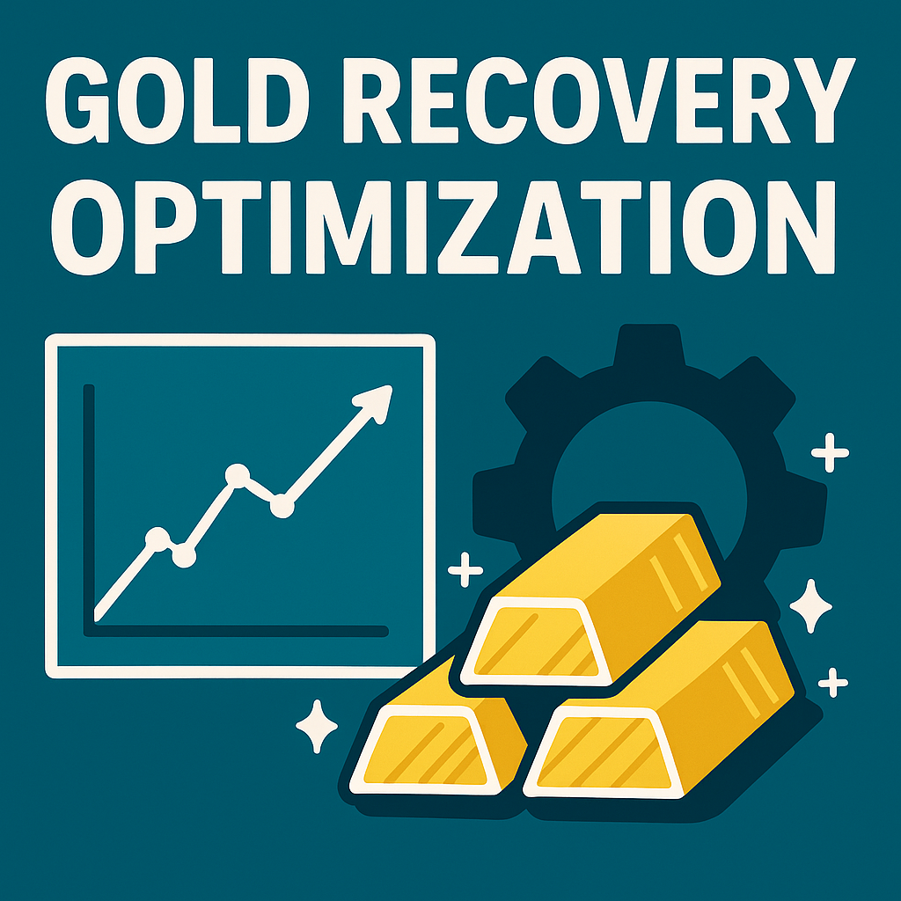

# 🪙 Gold Recovery Optimization

This project focuses on maximizing gold extraction efficiency in mining operations using data from industrial ore processing.

---

## 🧠 Objective

To optimize gold recovery rates by building regression models using industrial ore processing data and evaluating them with sMAPE.

---

## 📂 Dataset

- **Source:** Industrial ore processing dataset (training/testing)
- **Features:** Concentration levels, recovery rates, process stages
- **Target:** Final gold recovery percentage

---

## 🔧 Methods Used

- Data preprocessing: Null handling, outlier detection
- Feature analysis: Recovery formula verification, input/output comparison
- Modeling: Linear Regression, Ridge, Decision Tree Regressor
- Evaluation: sMAPE for both train and test predictions

---

## 🚀 Key Results

- Improved model performance over baseline predictions
- Verified discrepancies between input and output concentrations
- Provided insights into the process stages most affecting gold yield

---

## 📌 Technologies Used

- Python, Pandas, NumPy
- Scikit-learn, Matplotlib
- Jupyter Notebook
